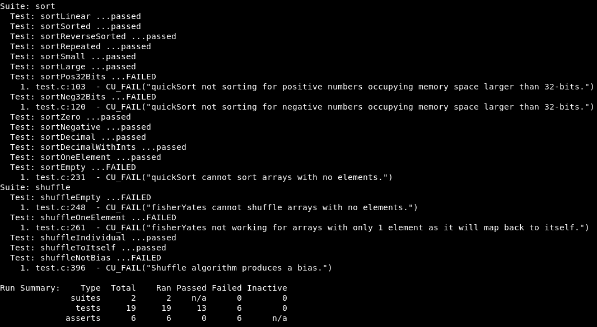
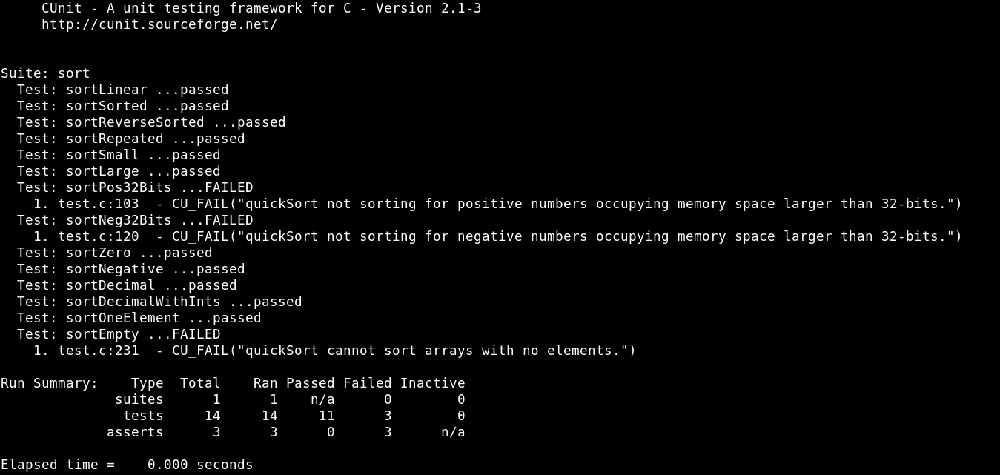
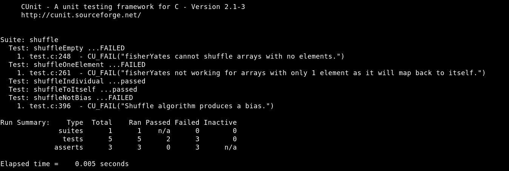

# Sort and Shuffle Test Cases

A program that uses CUnit to create test cases for the quick sort and fisherYates algorithms provided.

&nbsp;
## Characteristics
- The Knuth Fisher-Yates shuffle algorithm used in the iPod Playlist is inserted into the sortAndShuffle.c file. One could modify the pre-processor directive variables to enable the use of the algorithm to prove that the algorithm is unbiased.

&nbsp;
## Task - Create a program that tests the quicksort and fisherYates methods provided.

### Part 1. Test Completeness of quicksort.

&nbsp;
### Part 2. Test Completeness of fisherYates.
